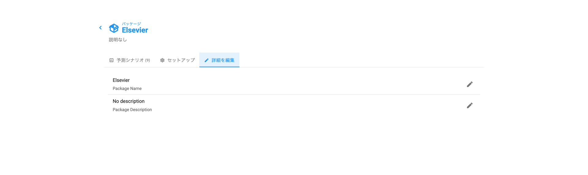

# パッケージ名・説明文の変更

> **※ 注意：** スクリーンショットはできるだけ日本語を利用しておりますが、機能制限により英語版で提供している箇所もありますので、予めご了承ください。

パッケージの作成時に、パッケージ名とパッケージの説明欄に記入することができます。より詳しい方法については、[パッケージ作成のチュートリアル](/unsub_guide_jpn/chtoriaru/pakkjino.md)をご覧ください。&#x20;

パッケージを作成した後にパッケージ名および説明欄の内容を変更するには、次の2つのうちいずれかを利用します。

### パッケージ・リストから

パッケージのリストから、お好きなパッケージの右側にある3つの縦並びの点のアイコンをクリックします。

<figure><figcaption>
画面右側にある3つの縦並びの点をクリックし、パッケージ名や説明の編集ができます。
</figcaption></figure>

「パッケージ名を編集」もしくは「説明を編集」の箇所をクリックするとポップアップが表示されます。既に入力されているテキストを編集し、完了したら「更新」をクリックします。

### パッケージが既に選択された状態から

パッケージ自体の画面に入った状態で、「**詳細を編集**」というタブを探します。

<figure><figcaption>
「詳細を編集」のタブを見つけクリックします。
</figcaption></figure>

右側にある鉛筆をクリックすると、既に入力されたテキストが表示されたポップアップが表示されます。テキストを編集して、「更新」をクリックします。
