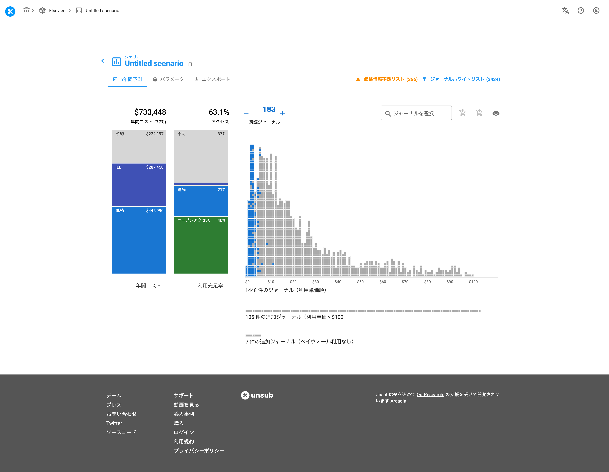
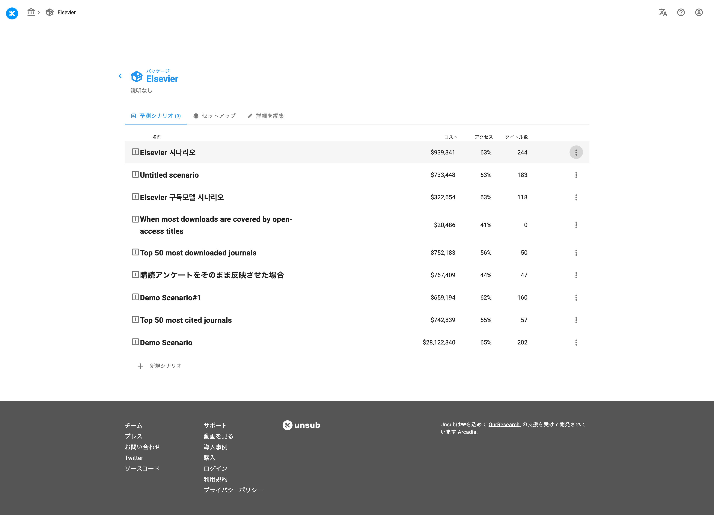

# シナリオの複製

> **※ 注意：** スクリーンショットはできるだけ日本語を利用しておりますが、機能制限により英語版で提供している箇所もありますので、予めご了承ください。

既にシナリオが作成されている場合は、新規追加ではなくコピーをお勧めします。コピーしたシナリオはパラメータやその他の設定が全て複製されますので、作業をやり直す必要はありません。シナリオページにて、シナリオ名の右側にあるコピーアイコンをクリックします。

<figure><figcaption>
シナリオ画面からのシナリオコピー
</figcaption></figure>

この後、複製された新しいシナリオに名前を付ける画面が表示されますので、名前を入力してください。

また、シナリオ一覧ページからもシナリオのコピーをすることができます。コピーしたいシナリオの右側にある3つの縦長の点の箇所をクリックし、「Make a copy」を選択します。

<figure><figcaption>
シナリオ一覧画面からのシナリオコピー
</figcaption></figure>

シナリオが複製されると、元のシナリオではなくコピーされたシナリオに遷移されます。
