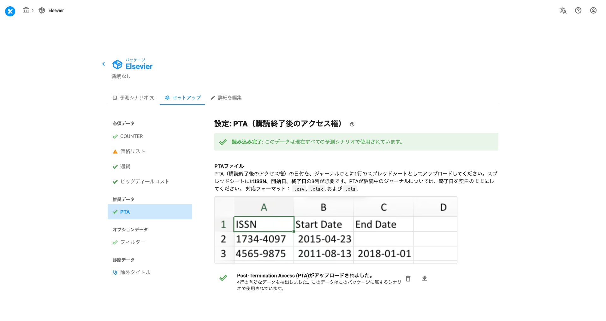

# PTA(購読終了後アクセス権)情報のアップロード

> **※ 注意：** このページのスクリーンショットは英語版です。実際の画面は日本語で表示されます。

各ジャーナルのPTA(Post-Termination Access)の日付、つまり解約後もアクセス可能なコンテンツの範囲設定は、Unsubで予測を行うにあたって重要な情報となります。特にビッグディールの解約後数年間は、バックコンテンツが全体的なアクセス確保において重要となってきます。

言うまでもなく、このことはジャーナルによって異なります。数学や哲学のように、バックコンテンツが長期間にわたって有効性を持ち続ける分野では、PTAは非常に重要です。他方、生物医学のように圧倒的に新しい論文が読まれる分野においては、PTAによる解約後のアクセス権はそこまで重要ではなくなります。Unsubでは膨大な数の図書館から集められた無数のデータからなる学習セットを活用して上記を考慮し、COUNTERデータを使ったお客様向けのカスタマイズを行っています。&#x20;

初期設定では、アップロードされたCOUNTERデータ中にあるどのジャーナルにもPTAの権利がない状態となっています。実際のところPTAはある場合が多く、その場合は解約後のアクセスについて少なく見積もられすぎています。ジャーナル単位でのPTA日付範囲のリストをアップロードすることで、予測をしなおすことができます。&#x20;

方法は以下の通りです。

まずPTAを設定したいパッケージに移動します。セットアップタブをクリックし、PTAの箇所までスクロールします。

<figure><figcaption>
PTAのセットアップ
</figcaption></figure>

上図のオレンジの箇所に、PTAのデータが不足しているという警告が表示されています。

ISSN、Start Date、End Dateの3つのカラムのみで構成されたシンプルなカスタムファイルをアップロードします。これで不足しているPTAのデータを補うことができます。

その他のヒント

* 入力する日付は、可能な限りYYYY-MM-DD、ISO 8601の形式をお勧めします。ただ他の形式の日付もおおよそ読み込み可能で、通常であれば問題なくアップロードすることができます。
* PTAが現在も進行中の場合、該当のジャーナルのEnd Date欄は空欄にしてください。&#x20;

以下はその例です。

<figure><figcaption></figcaption></figure>

アップロードの際は、クリップのアイコンをクリックして該当ファイルを選択し、アップロードの矢印をクリックします。処理にはおよそ1～2分を要し、アップロードが完了すると下図のような画面が表示されます。

<figure><figcaption>
PTAファイルのアップロードに成功した例
</figcaption></figure>

PTAファイルのセクションを見ると「カスタム日付範囲を使用しているジャーナルが373件あります」と表示されています。右端のダウンロード矢印をクリックすると、そのジャーナルの一覧と設定された日付範囲を確認することができます。&#x20;

このデータを後で別のものと差し替えたい場合は、右側にあるゴミ箱をクリックして新しいファイルをアップロードしてください。シナリオ予測は自動的に新しいデータが適用されて再算出されます。

### UnsubのPTAに関するいくつかの注意点

* PTAは2012年までのものに対応しています。PTA開始日が2012年より前のものは編集する必要はありませんが、開始日が自動的に2012年に変換されますのでご注意ください。
* PTAの終了日が現在進行中（空白）または今年よりも先の年である場合、終了日は現在の年から1を引いた値に設定されます。例えば、あるタイトルの PTA 終了日が空白、2022年もしくは2023年以降に設定されている場合、当該タイトルのPTA終了日は2021年と表示されます。

&#x20;
