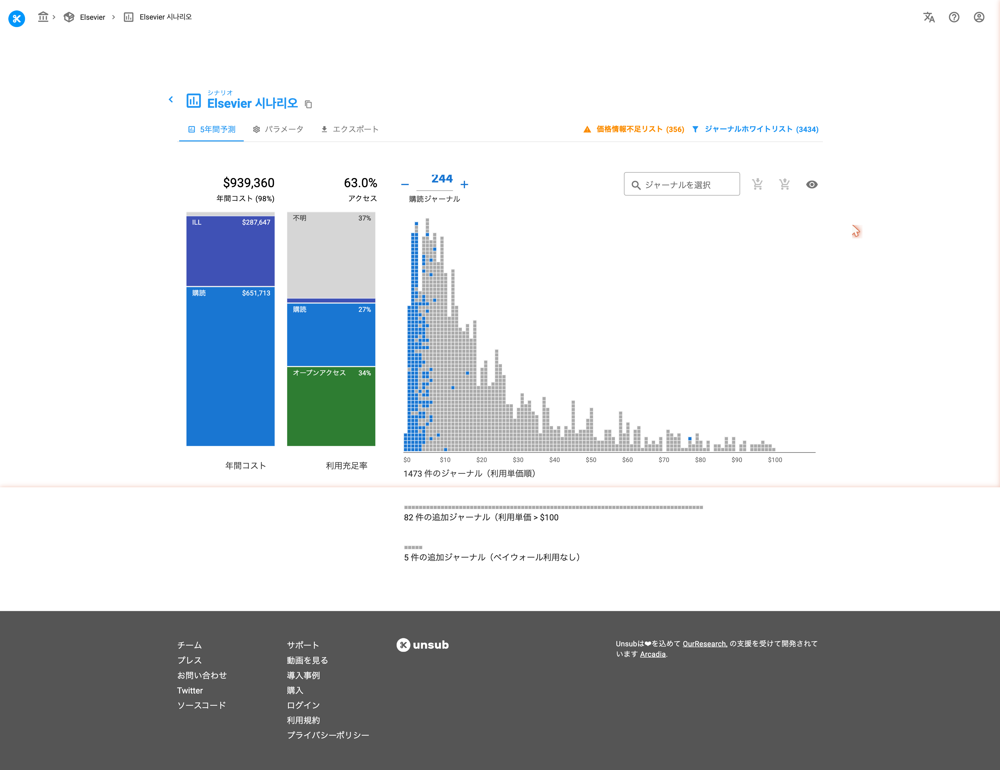
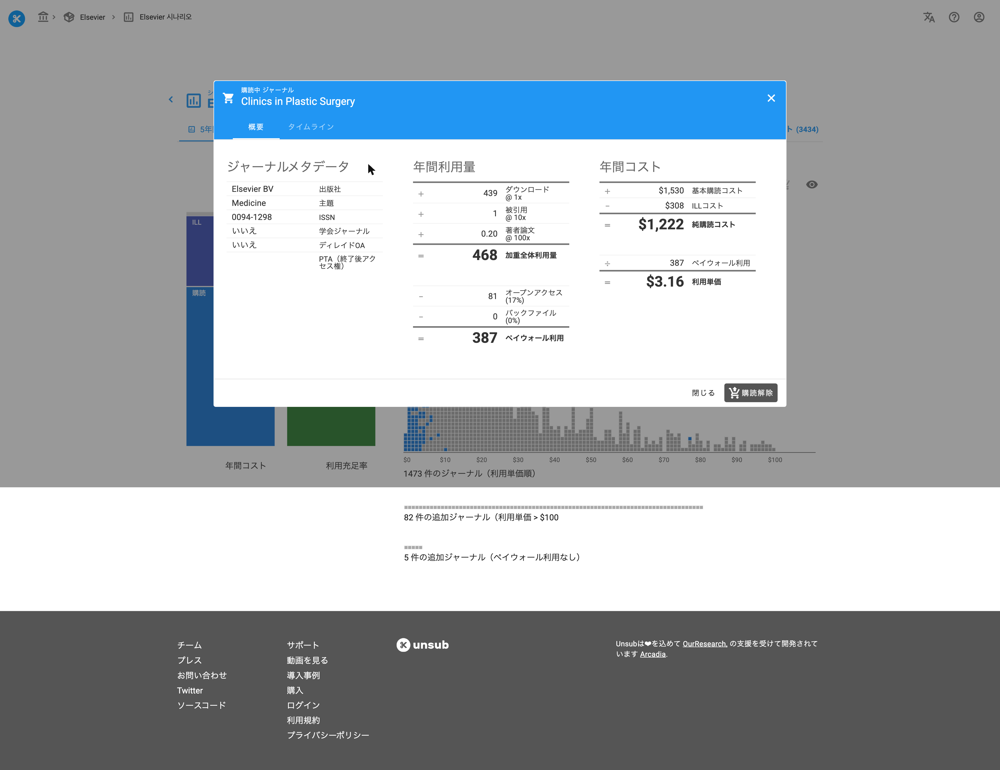
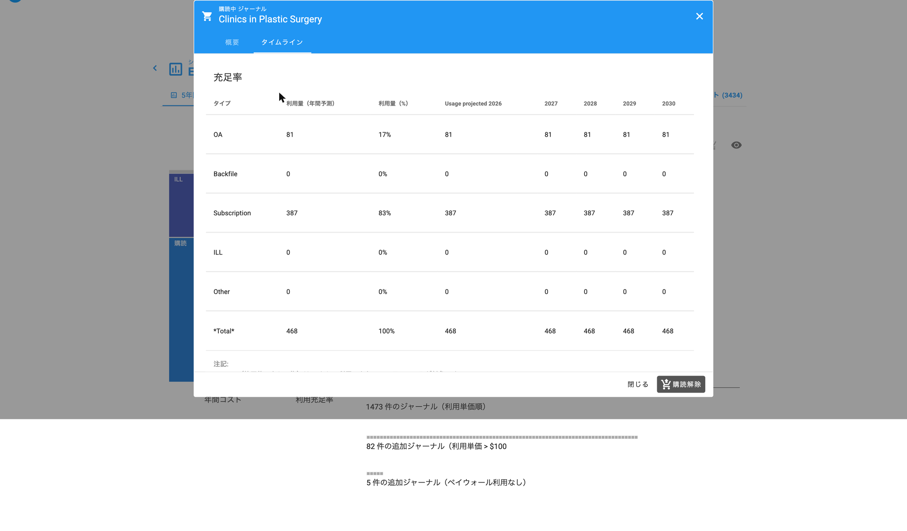

# 個別ジャーナルの閲覧

シナリオ画面のヒストグラムまたはテーブルビューで任意のジャーナルをクリックすると、単一ジャーナルビューを表示することができます。

下図のヒストグラムでジャーナルのボックスをクリックすると、単一ジャーナル表示になります。

こうすることで、タイトルの詳細が表示されます。

個別タイトルの詳細画面で、ジャーナルのメタデータと[利用単価（Cost per Use）](reference/cost-per-use.md)の計算の内訳が表示され、購読の設定/解除ができます。

### 概要タブ

概要タブには、ジャーナルメタデータ、年間利用量、年間コスト、利用単価が表示されます。

#### ジャーナルメタデータ

このセクションは、以下を含みます。

* 主題: OpenAlexの"コンセプト"から抽出された、ジャーナルの分野を表示します。詳しくは[こちらの記事](reference/data-export.md)をご覧ください。
* ISSN: ジャーナルに紐づいているISSN（もしくはISSN-L）
* 学会ジャーナル: 当該ジャーナルが学会ジャーナルの場合は"はい"、そうでない場合は"いいえ"と表示されます。
* ディレイドOA: 当該ジャーナルが遅延OAジャーナルの場合は"はい"、そうでない場合は"いいえ"と表示されます。"はい"の場合、エンバーゴ期間終了後は当該ジャーナルのコンテンツがフリーになります。この場合"OAエンバーゴ期間"の別項目が表示され、月単位でその期間が表示されます。
* PTA（終了後アクセス権）: この項目はPTAデータをアップロードしていない場合空欄となります。アップロードが済んでいる場合、購読終了後のアクセス権の期間が表示されます。

> **🚨 重要：**
> 数値は四捨五入されています。ご自身で計算されると、表示されている数値とは多少の誤差が生じることがありますが、これはすべてUnsub側で四捨五入していることが原因です。ご不明な点がありましたら、<support@unsub.org>までご連絡ください。

> **ℹ️ 情報：**
> 表示されている予測の数値ですので、現在の統計の数値とは異なります。

#### 年間利用量

3つの項目があり、一部は重み付けされています。

* ダウンロード: COUNTER上の統計データから予測される推定ダウンロード回数
* 被引用: お客様機関のメンバーが発表した論文上で、当該ジャーナルからの推定引用数
* 著者論文: 当該ジャーナルへの、お客様機関メンバーからの推定投稿数

無料での論文利用を含めてしまうと正確な利用単価が出ないので、ペイウォール利用（実際にお金をかけて利用されている回数）を算出します。これを求めるには、加重全体利用量から下記の項目を差し引きます。

* オープンアクセス: オープンアクセスコンテンツの推定利用数
* バックファイル: PTAおよびバックファイルの推定利用数

#### 年間コスト

ジャーナルの個別購読にかかるコストは単純ではありません。Unsubでは、もし購読しなかった場合に発生する[ILLの費用](how-it-works/ill-costs.md)も考慮します。そのコストである純購読コストは、[基本購読料](how-it-works/subscription-costs.md)とILLの見込みコストの差額となります。

#### 利用単価（Cost per Use）

利用単価は、純購読コストをペイウォール利用の数で割った額となります。

### タイムラインタブ

タイムラインタブには、いくつかのセクションがあります。

* アクセス充足: 当該ジャーナル利用の予測内訳
* オープンアクセス: OAによる利用の予測内訳
* インパクト: ダウンロード、引用、投稿の数を計上した予測利用回数
* 購読コスト: 年ごとの予測購読費用
* APIレスポンス: [JSON](https://en.wikipedia.org/wiki/JSON)フォーマットのレスポンス（技術者向け）
