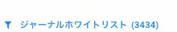
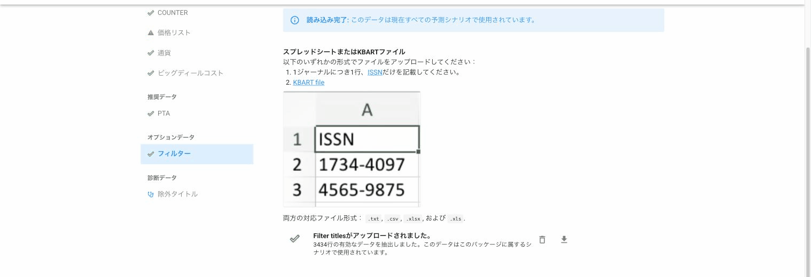

# "ジャーナルホワイトリスト"のメッセージは何を意味するのでしょうか？

> **※ 注意：** スクリーンショットはできるだけ日本語を利用しておりますが、機能制限により英語版で提供している箇所もありますので、予めご了承ください。

シナリオ画面の上部に、下のようなマークが表示されることがあります。

<figure><figcaption></figcaption></figure>

ジャーナルのホワイトリストをアップロードしていると、このようなメッセージが表示されます。Unsubでは、ホワイトリストを行うとそれらのタイトルしかシナリオに表示されなくすることができ、リスト外のタイトルはすべて除外されます。

どのタイトルがホワイトリスト化されているかを確認するには、パッケージのページからセットアップタブを選択し、フィルターのメニューを選択します。下向きの矢印をクリックすると、ホワイトリストのスプレッドシートをダウンロードできます。

<figure><figcaption></figcaption></figure>

ホワイトリストを削除したいときは、ごみ箱のアイコンをクリックします。フィルタリングについて詳細は、[こちらの記事](/how-to-guides/upload-journal-filter.md)をご参照ください。
