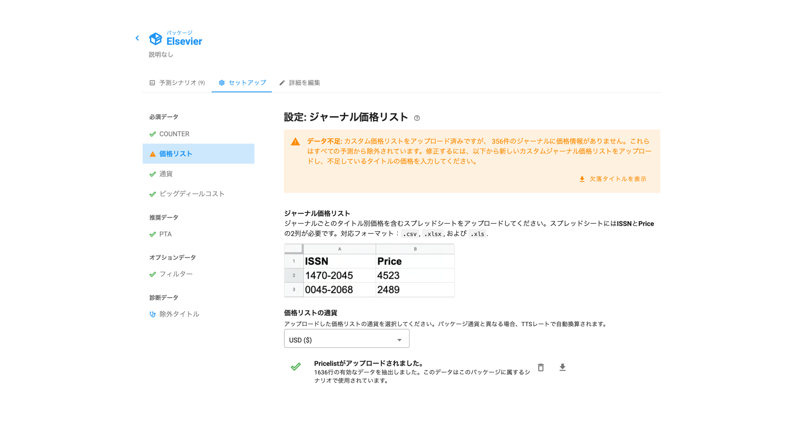

# "価格情報不足リスト"の警告は何を意味するのでしょうか？

予測シナリオの上部に、以下のような警告が表示されることがあります。

この警告は、COUNTERレポートに含まれるジャーナルの中に、購読価格が不明なものがある場合に表示されます。

これらのジャーナルを予測シナリオに含めたいのですが、タイトル単位の購読価格がなければ、タイトル毎の利用単価を計算することができません。

そのため、価格情報のないジャーナルは予測ダッシュボードから除外されます。お客様にとって重要なタイトルが除外されている可能性があるため、Unsubの予測精度が低下してしまいます。

営業担当者に連絡して、不足している価格の見積もりを入手してください。

どのジャーナルの価格が不足しているかを確認するには、パッケージページに移動し（画面左上のパッケージ名をクリック）、セットアップタブを選択して、「価格リスト」メニューを開きます。「欠落タイトルを表示」をクリックすると、価格情報のないジャーナル一覧をスプレッドシートでダウンロードできます。

不足しているタイトルの価格見積もりが入手できたら、カスタムジャーナル価格リストファイルをアップロードして警告を解消できます。価格リストファイルのフォーマットとアップロード方法については、[こちらの記事](how-to-guides/upload-title-prices.md)をご覧ください。
