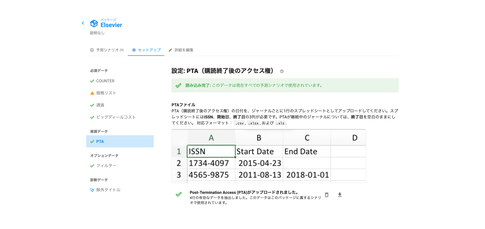

# "PTA不足"の警告は何を意味するのでしょうか？

予測シナリオの上部に、「PTA不足」という警告が表示されることがあります。

この警告は、パッケージにPTA（購読終了後アクセス権）ファイルがまだアップロードされていない場合に表示されます。

PTAにはさまざまな呼称があります。バックファイル、PCA（Post-Cancellation Access、キャンセル後アクセス権）、PA（Perpetual Access、永続的アクセス権）とも呼ばれます。

PTAの日付ファイルをUnsubに読み込ませることは、正確な予測を得るために重要です。現在の購読をキャンセルした場合に、購読終了後のアクセス権でどの程度の利用を賄えるかをUnsubに把握させることができます。

PTAファイルがアップロードされていない状態では、Unsubはすべてのタイトルに対してPTAの権利がゼロであると仮定します。この場合、キャンセルシナリオにおけるアクセス量を過小評価している可能性が高くなります。過去の事例から、ほとんどの大学では12〜25%の利用をPTAで賄えると見込まれており、これはオープンアクセスで得られるアクセス量を上回ります。

この警告を解消するには、パッケージページに移動し（画面左上のパッケージ名をクリック）、セットアップタブを選択して、「PTA」メニューからPTAの日付ファイルをアップロードしてください。PTAファイルのフォーマットとアップロード方法については、[こちらの記事](how-to-guides/upload-pta-data.md)をご確認ください。

