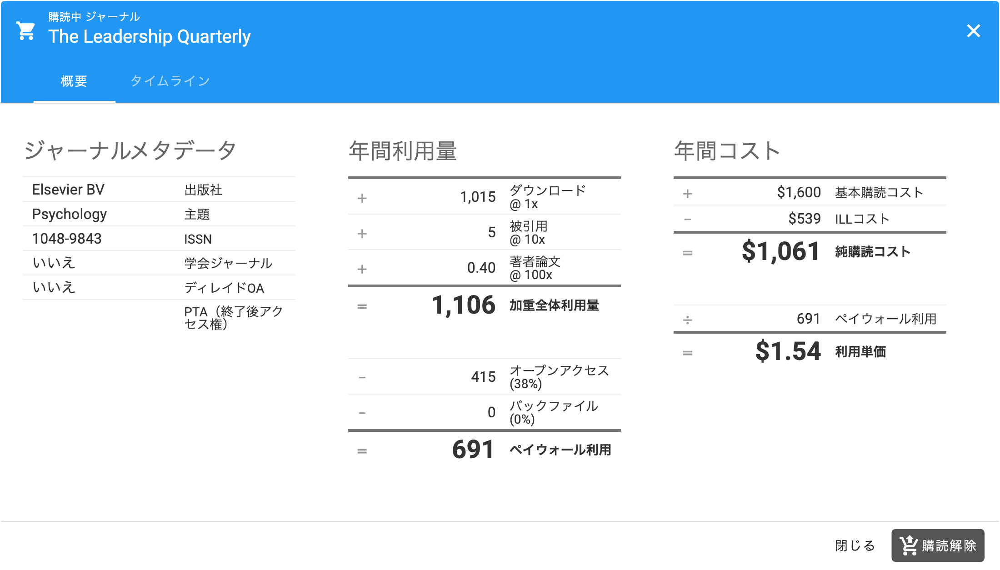
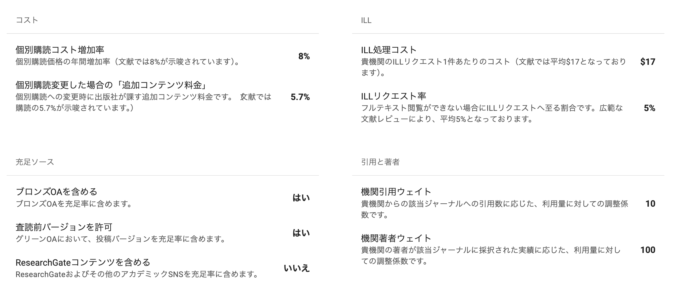

# タイトル毎の個別価格が、設定した通りに表示されないのはなぜですか？

アップロードしたタイトル単位の価格と、予測シナリオに表示される価格の違いについて

**問題：** パッケージの設定タブで、タイトル単位のジャーナル価格リストをアップロードしたとしましょう。例えば「The Journal of Example Studies」の価格を$1,000に設定したとします。

しかし、予測シナリオで同じジャーナルの価格を見ると、$1,000より高くなっています。

**解決策：** アップロードした価格は、当該ジャーナルの現在の年間購読価格です。

一方、シナリオページに表示されている価格は、今後5年間の予測年間価格の平均値です。シナリオビューに表示されるすべての数値は、今後5年間の将来の状態を示しており、具体的にはその5年間の1年あたりの平均を示しています。

シナリオビューの数値が高くなるのは、今後5年間でこのジャーナルの価格が現在より上昇すると予測されるためです。将来のジャーナル価格を予測する際、毎年の価格上昇率をモデルに組み込んでいます。デフォルトでは8%（過去の傾向に基づく）に設定されていますが、パラメータ → コスト → 個別購読コスト増加率 から、0%を含む任意の数値に変更することができます。

