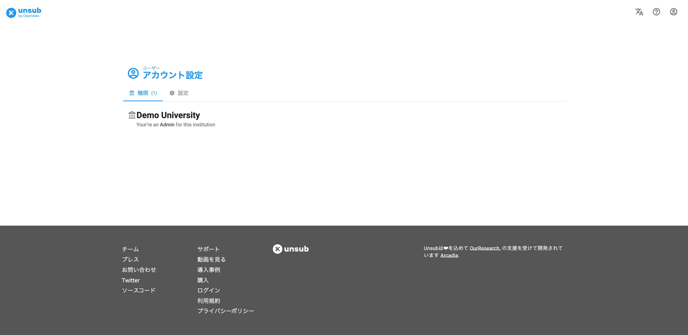
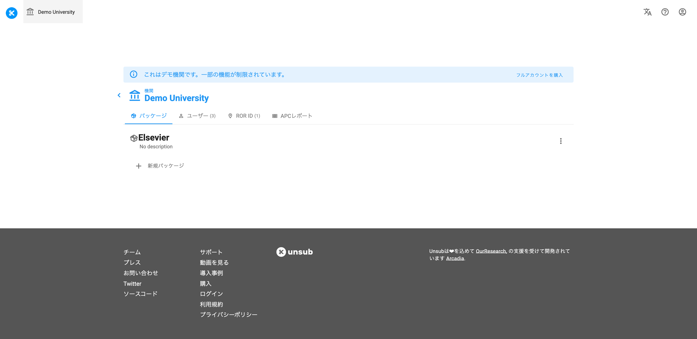
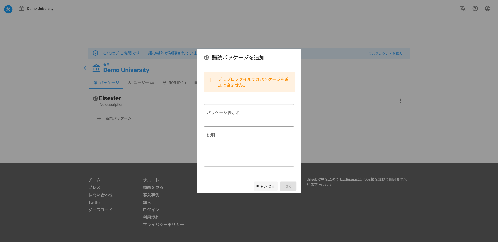
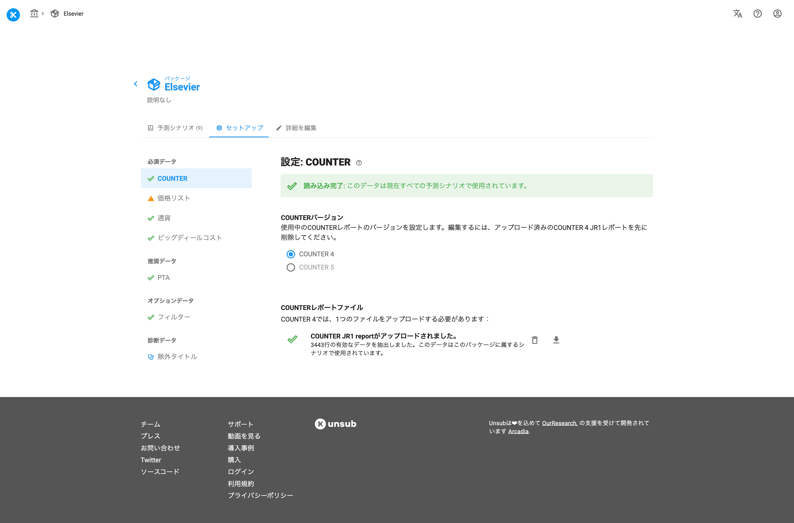
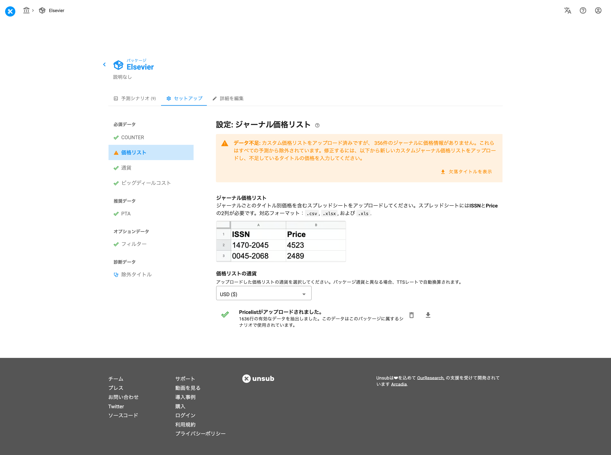
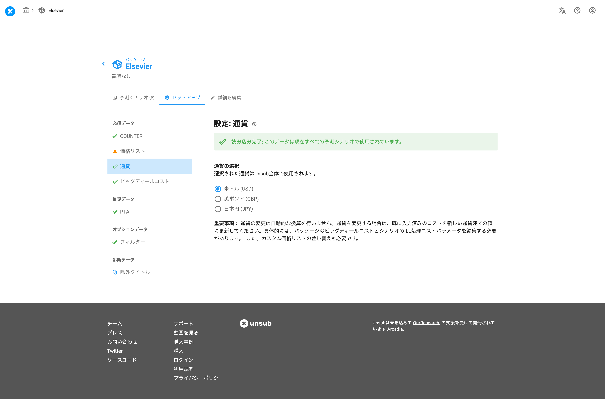
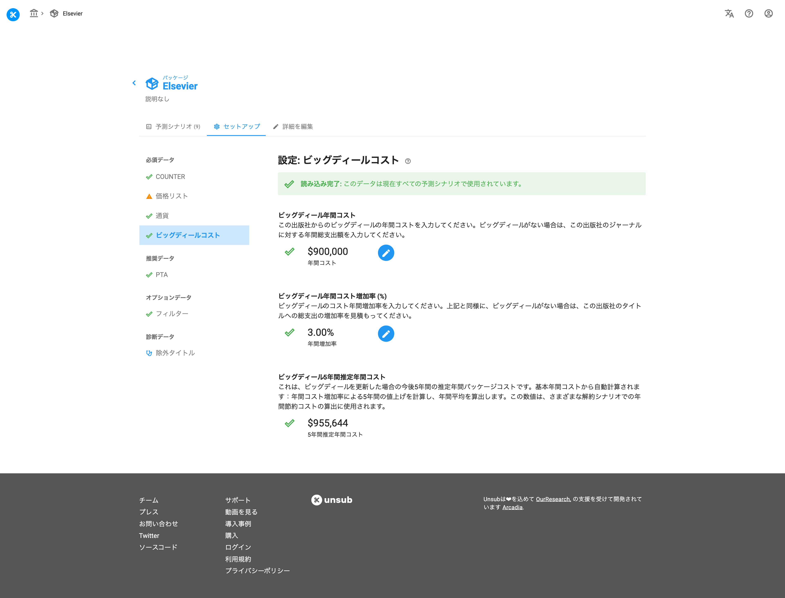
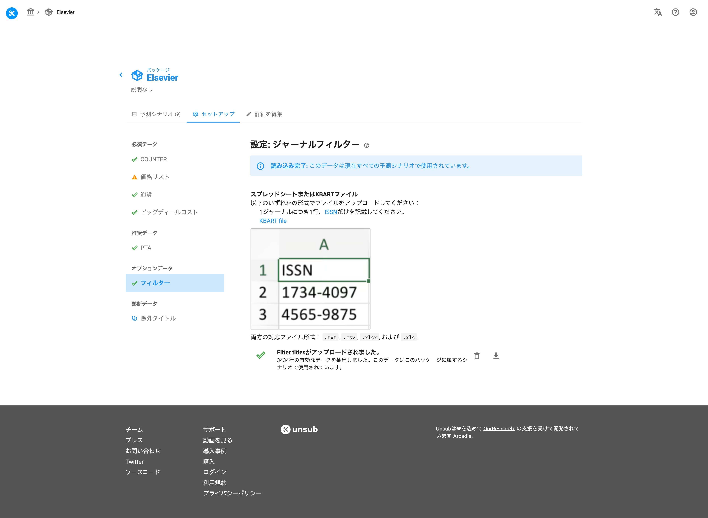

# パッケージの作成

> **※ 注意：** このページのスクリーンショットは英語版です。実際の画面は日本語で表示されます。

> **⚠️ 注意：**
> ログインはお済みでしょうか？まだの場合は、[こちら](/unsub_guide_jpn/chtoriaru/roguin.md)を参照にログインしてください。

このページでは、Unsub上でパッケージを作成する方法を説明します。

パッケージとは、ジャーナルの予測シナリオを格納するコンテナのようなものです。パッケージは、出版社もしくはアグリゲーターとの契約を更新するかどうかを検討し始めるときに設定するものとお考えください。Unsub上でのパッケージは、出版社やアグリゲーターの購読パッケージと類似しているものです。

## 1 新規パッケージの作成

&#x20;ご所属の教育機関をクリックします。下の画像は「Demo University」の場合です。複数の教育機関が表示される場合は、パッケージを作成したい教育機関を選んでください。

<figure><figcaption>
ご所属の教育機関をクリックしてください。
</figcaption></figure>

まだパッケージが作成されていない場合は、下のボタンが表示されます。最初のパッケージを作成するには、「+ **New package**」をクリックします。

<figure><figcaption>
「+ 新規パッケージ」をクリックします。
</figcaption></figure>

**Add subscription package**というタイトルのポップアップウィンドウが表示されます。

<figure><figcaption>
購読パッケージの追加を行います。
</figcaption></figure>

パッケージの表示名（必須）を入力します。パッケージの作成には、パッケージ名が必要です。

パッケージの説明（オプション）を入力します。この説明欄には、パッケージの重要な詳細について、同僚やあなた自身を後で思い出すのに役立つような情報をメモしておくことができます。（パッケージ名と説明文は後での変更が可能です。）

その後OKをクリックすると、パッケージが作成されます。パッケージのページでは作成されたすべてのパッケージがリストアップされます。パッケージはいくつでも作成でき、1つのパッケージは1つのパブリッシャーを扱います。

<figure><figcaption>
作成したパッケージはこのように表示されます。
</figcaption></figure>

## 2 パッケージのセットアップ

パッケージの作成が完了したら、次セットアップを行います。

必須項目

* COUNTER準拠利用統計のアップロード
* 価格リストのアップロード
* 通貨（米ドル、英ポンド、日本円）の選択
* ビッグディール（パッケージ契約）にかかっている金額

推奨事項

* 購読終了後アクセス権(PTA:Post Termination Access)の情報アップロード(Excelフォーマット)

オプション事項

* タイトルホワイトリスト

以下は、セットアップを図式化したガイドです。シナリオの詳細についてはこの後のチュートリアルで説明しますが、セットアップの全体像については、このガイドをご覧ください。

<figure>
<svg viewBox="0 0 720 520" xmlns="http://www.w3.org/2000/svg" style="max-width:720px;width:100%;font-family:-apple-system,BlinkMacSystemFont,'Hiragino Sans','Noto Sans JP',sans-serif;">
  <!-- 背景 -->
  <rect width="720" height="520" fill="#f8f9fa" rx="8"/>
  <!-- 必須項目 (パッケージレベル) -->
  <rect x="20" y="15" width="680" height="130" fill="none" stroke="#333" stroke-width="2" rx="6"/>
  <text x="35" y="40" font-size="14" font-weight="bold" fill="#333">必須項目</text>
  <!-- COUNTER -->
  <rect x="35" y="50" width="230" height="80" fill="#a8d5a2" stroke="#6aab64" stroke-width="1.5" rx="4"/>
  <text x="150" y="75" font-size="12" font-weight="bold" fill="#333" text-anchor="middle">COUNTERファイルのアップロード</text>
  <text x="150" y="93" font-size="10" fill="#555" text-anchor="middle">COUNTER 4: JR1</text>
  <text x="150" y="106" font-size="10" fill="#555" text-anchor="middle">- または -</text>
  <text x="150" y="119" font-size="10" fill="#555" text-anchor="middle">COUNTER 5: TR_J2, TR_J3, TR_J4</text>
  <!-- 通貨 -->
  <rect x="280" y="50" width="130" height="35" fill="#90caf9" stroke="#5b9bd5" stroke-width="1.5" rx="4"/>
  <text x="345" y="73" font-size="12" font-weight="bold" fill="#333" text-anchor="middle">通貨の設定</text>
  <!-- タイトル価格 -->
  <rect x="280" y="95" width="130" height="35" fill="#a8d5a2" stroke="#6aab64" stroke-width="1.5" rx="4"/>
  <text x="345" y="118" font-size="12" font-weight="bold" fill="#333" text-anchor="middle">タイトル価格</text>
  <!-- ビッグディール -->
  <rect x="425" y="50" width="260" height="45" fill="#90caf9" stroke="#5b9bd5" stroke-width="1.5" rx="4"/>
  <text x="555" y="70" font-size="12" font-weight="bold" fill="#333" text-anchor="middle">ビッグディールのコストと</text>
  <text x="555" y="86" font-size="12" font-weight="bold" fill="#333" text-anchor="middle">年間値上げ率の設定</text>
  <!-- 推奨・オプション -->
  <rect x="20" y="160" width="340" height="70" fill="none" stroke="#333" stroke-width="2" rx="6"/>
  <text x="35" y="182" font-size="14" font-weight="bold" fill="#333">推奨事項</text>
  <rect x="35" y="192" width="310" height="30" fill="#a8d5a2" stroke="#6aab64" stroke-width="1.5" rx="4"/>
  <text x="190" y="212" font-size="12" font-weight="bold" fill="#333" text-anchor="middle">購読終了後アクセス権(PTA)データ</text>
  <rect x="380" y="160" width="320" height="70" fill="none" stroke="#333" stroke-width="2" rx="6"/>
  <text x="395" y="182" font-size="14" font-weight="bold" fill="#333">オプション</text>
  <rect x="395" y="192" width="290" height="30" fill="#a8d5a2" stroke="#6aab64" stroke-width="1.5" rx="4"/>
  <text x="540" y="212" font-size="12" font-weight="bold" fill="#333" text-anchor="middle">タイトルホワイトリスト</text>
  <!-- シナリオパラメータ (シナリオレベル - 破線) -->
  <rect x="20" y="250" width="680" height="140" fill="none" stroke="#333" stroke-width="2" stroke-dasharray="8,4" rx="6"/>
  <text x="35" y="275" font-size="14" font-weight="bold" fill="#333">シナリオパラメータ（設定可能）</text>
  <!-- コスト -->
  <rect x="35" y="285" width="210" height="55" fill="#90caf9" stroke="#5b9bd5" stroke-width="1.5" rx="4"/>
  <text x="140" y="305" font-size="11" font-weight="bold" fill="#333" text-anchor="middle">コスト</text>
  <text x="140" y="320" font-size="10" fill="#555" text-anchor="middle">・タイトル別購読コスト増加率</text>
  <text x="140" y="333" font-size="10" fill="#555" text-anchor="middle">・タイトル別コンテンツ料金</text>
  <!-- フルフィルメント -->
  <rect x="35" y="348" width="210" height="35" fill="#90caf9" stroke="#5b9bd5" stroke-width="1.5" rx="4"/>
  <text x="140" y="363" font-size="11" font-weight="bold" fill="#333" text-anchor="middle">フルフィルメント</text>
  <text x="140" y="377" font-size="9" fill="#555" text-anchor="middle">ブロンズOA? グリーンOA? ResearchGate?</text>
  <!-- ILL -->
  <rect x="260" y="285" width="210" height="55" fill="#90caf9" stroke="#5b9bd5" stroke-width="1.5" rx="4"/>
  <text x="365" y="305" font-size="11" font-weight="bold" fill="#333" text-anchor="middle">相互貸借 (ILL)</text>
  <text x="365" y="320" font-size="10" fill="#555" text-anchor="middle">・ILL取引コスト</text>
  <text x="365" y="333" font-size="10" fill="#555" text-anchor="middle">・ILLリクエスト率</text>
  <!-- 引用/著者 -->
  <rect x="485" y="285" width="200" height="55" fill="#90caf9" stroke="#5b9bd5" stroke-width="1.5" rx="4"/>
  <text x="585" y="305" font-size="11" font-weight="bold" fill="#333" text-anchor="middle">引用 / 著者</text>
  <text x="585" y="320" font-size="10" fill="#555" text-anchor="middle">・機関の引用ウェイト</text>
  <text x="585" y="333" font-size="10" fill="#555" text-anchor="middle">・機関の著者ウェイト</text>
  <!-- セットアップ完了 -->
  <text x="35" y="420" font-size="16" font-weight="bold" fill="#333">セットアップ完了！</text>
  <rect x="35" y="430" width="120" height="60" fill="#e8f5e9" stroke="#a8d5a2" stroke-width="1" rx="3"/>
  <rect x="42" y="460" width="12" height="25" fill="#a8d5a2"/>
  <rect x="58" y="450" width="12" height="35" fill="#a8d5a2"/>
  <rect x="74" y="455" width="12" height="30" fill="#90caf9"/>
  <rect x="90" y="440" width="12" height="45" fill="#a8d5a2"/>
  <rect x="106" y="445" width="12" height="40" fill="#90caf9"/>
  <rect x="122" y="435" width="12" height="50" fill="#a8d5a2"/>
  <!-- 凡例 -->
  <line x1="450" y1="430" x2="500" y2="430" stroke="#333" stroke-width="2"/>
  <text x="510" y="434" font-size="11" fill="#333">パッケージレベル</text>
  <line x1="450" y1="450" x2="500" y2="450" stroke="#333" stroke-width="2" stroke-dasharray="6,3"/>
  <text x="510" y="454" font-size="11" fill="#333">シナリオレベル</text>
  <rect x="450" y="465" width="50" height="14" fill="#a8d5a2" stroke="#6aab64" stroke-width="1" rx="2"/>
  <text x="510" y="477" font-size="11" fill="#333">ファイル</text>
  <rect x="450" y="485" width="50" height="14" fill="#90caf9" stroke="#5b9bd5" stroke-width="1" rx="2"/>
  <text x="510" y="497" font-size="11" fill="#333">設定</text>
</svg>
<figcaption>
Unsubセットアップの図ガイド
</figcaption>
</figure>

必須項目のファイルと情報がアップロードおよび入力されていることを確認してください。推奨セクションにあるものについてはあるに越したことはないですが、もしこの後で用意できるのであれば、その際にこのページで確認してください。

新規のパッケージは、下図のように表示されます。（4つの必須データタブには赤い❌がついていますが、これはまだ設定する必要があることを示しています）

<figure><figcaption>
必須項目の入力
</figcaption></figure>

PTAの項目とオプションデータ（Filter）の下に灰色の選択できないタブがそれぞれ1つ存在しますが、これらは上の4つの必須データが用意されるまで、操作することはできません。

### 2.1 COUNTER準拠の利用統計

お客様機関におけるジャーナル単位の利用統計は、Unsubを使った予測を行う上でいちばん重要なデータとなります。

まずはセットアップ画面の左側にある「COUNTER」をクリックします。&#x20;

下図のようなページが表示され、COUNTERデータ・ファイルがまだアップロードされていないことを示す赤いアラートが表示されます。UnsubはCOUNTER 4と5に対応しており、COUNTER 4の場合は1ファイル（JR1）、COUNTER 5の場合は3ファイル（TR\_J2, TR\_J3, TR\_J4）をアップロードします。

次に、ファイルをアップロードします。該当のCOUNTERファイルをクリップのボタンから選択し、それぞれのファイル名が記載された箇所の右側にある上向きの矢印ボタンを押すとファイルのアップロードが開始されます。

<figure><figcaption>
COUNTERのセットアップページ
</figcaption></figure>

アップロードしたファイルに問題がある場合、Unsubが通知でお知らせします。

COUNTER準拠利用統計のアップロードの詳細については、[こちら](#21-counterno)をご参照ください。

> **ℹ️ 情報：**
> 他のタブ(Pricelist, Currency, Big Deal Costs)の項目も、COUNTERデータがアップロードされている間に入力することができます。

### 2.2 タイトル価格

次に、左側の「Pricelist」をクリックすると下図のような画面になります。

<figure><figcaption>
タイトル価格のセットアップ
</figcaption></figure>

赤い警告は、価格情報がないジャーナルの数を表示しています。またタイトル価格情報のないジャーナルをリストアップしたファイルをダウンロードすることができます。&#x20;

パッケージ作成の初期段階ではすべてのタイトル価格がそろっていないこともあるかと思いますが、意図せず漏れているタイトルがある場合はVIEW MISSING TITLESのボタンを押下してください。漏れているタイトルのISSN、タイトル、COUNTERデータの概算が記載されたスプレッドシートがダウンロードされますので、今後重要となる価格情報がUnsubにきちんと反映されているかどうかを確認することができます。

この漏れているタイトルのリストを出版社/アグリゲーターの営業担当者に確認し、個々のタイトル/アラカルトの価格を確認してください。

漏れているタイトルの価格情報を入手したら、[こちら](/unsub_guide_jpn/gogaido/taitorunoappurdo.md)を参照し適切な書式を設定してください。

タイトル価格リストファイルの準備が出来たらデバイス上でそのファイルを選択し、右側にある上向きの矢印を押してアップロードしてください。

### 2.3 通貨

次に、画面左側の「Currency」タブを開きます。クリックすると下図のように表示されます。

<figure><figcaption>
通貨のセットアップ
</figcaption></figure>

USD（米ドル）、GBP（英ポンド）、JPY（日本円）のいずれかひとつを選択します。ここで選択した通貨によってタイトル価格に使用されるパブリックプライスリストが決定されます。

**注意：** JPYを選択した場合、JPYの価格のない外貨建てのジャーナルは、お客様でJPYに転換し、タイトル毎のISSNと価格を入れる必要があります。

通貨設定の詳細については、[こちら](/unsub_guide_jpn/gogaido/no.md)を参照してください。

### 2.4 Big Deal costs

画面左側の「Big Deal Costs」をクリックすると、下図のように表示されます。

<figure><figcaption>
ビッグディールコストのセットアップ
</figcaption></figure>

ここではビッグディール（パッケージ契約）の年間コストと、その値上げ率を設定することができます。

詳細については、[こちら](/unsub_guide_jpn/gogaido/biggudrupakkjino.md)をご確認ください。

### 2.5 Perpetual access永続的なアクセス権

この時点で、4つの必須データセクション(COUNTER, Pricelist, Currency, Big Deal Costs)が入力された状態です。この状態でもそのまま[シナリオを作成](/unsub_guide_jpn/chtoriaru/shinariono.md)することはできますが、ここではより正確な推測をするためのオプション入力項目について説明します。この項目は、後から設定することも可能です。

&#x20;画面左側のPTAをクリックすると、下図のように表示されます。

<figure><figcaption>
PTAセットアップのページ
</figcaption></figure>

オレンジの警告は、PTA(Post Termination Access)データのアップロードを推奨しているものです。

もしこの時点でPTAのデータをお持ちでない場合、[PTAデータの収集](/unsub_guide_jpn/gogaido/akusesuptanoarudta.md)と[データのフォーマット](/unsub_guide_jpn/gogaido/ptaakusesunoappurdo.md)方法に関するヒントをご覧ください。

Once you have your PTA file upload it by navigating to the file on your computer, then press the up arrow to the right.&#x20;

PTAファイルの準備が出来たら、デバイス上でそのファイルを選択、画面右側にある上向きの矢印を押下してファイルをアップロードしてください。 PTAファイルのフォーマットとPTAデータのアップロード方法については、[こちら](/unsub_guide_jpn/gogaido/ptaakusesunoappurdo.md)を参照してください。

### 2.6 フィルター

オプションで、パッケージ内のすべてのシナリオに表示されるタイトルを、ジャーナルの「ホワイトリスト」としてフィルタリングすることができます。フィルターを適用した後に気が変わった場合は、セットアップページからファイルを削除すれば、フィルターを適用していないダッシュボードに戻ることができます。

画面の左側にある「フィルター」をクリックすると、下図のように表示されます。

<figure><figcaption>
フィルターのセットアップページ
</figcaption></figure>

ジャーナルのフィルタリングについての詳細は、[こちらの記事](/unsub_guide_jpn/gogaido/jnarufirutno.md)をご覧ください。

---

**次のステップ：** パッケージを作成したら、次は[シナリオの作成](tutorials/create-a-scenario.md)です。
