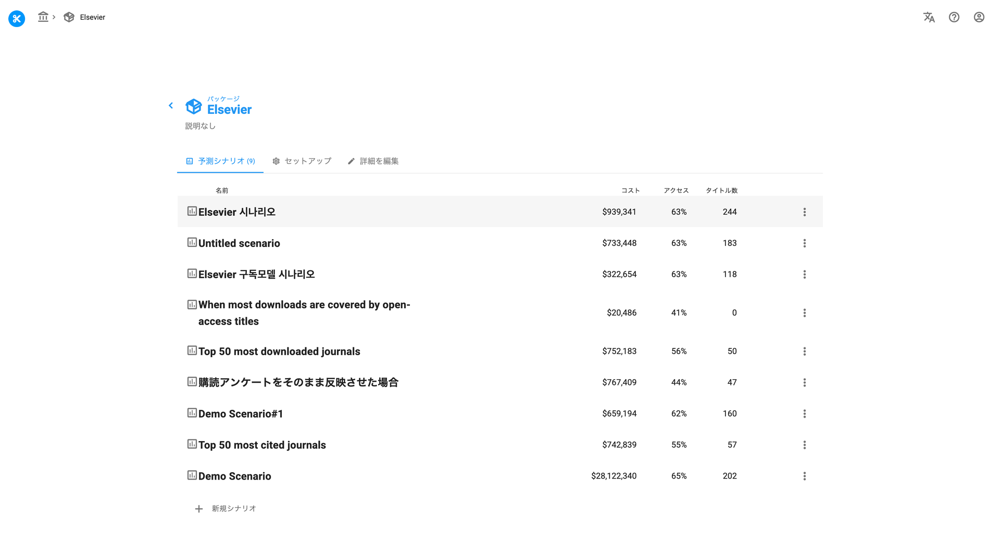
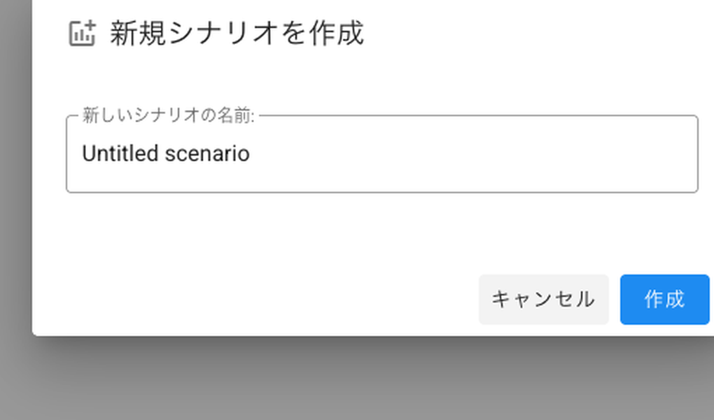
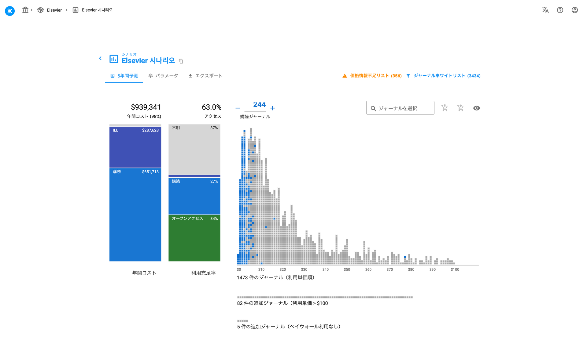

# シナリオの作成

> **※ 注意：** スクリーンショットはできるだけ日本語を利用しておりますが、機能制限により英語版で提供している箇所もありますので、予めご了承ください。

> **⚠️ 注意：**
> パッケージの作成がまだお済みでない場合は、[こちら](/unsub_guide_jpn/chtoriaru/pakkjino.md)から作成をお願いいたします。

このチュートリアルでは、Unsubで[シナリオ](/unsub_guide_jpn/refarensu/shinario.md)を作成する一連の手順と、それを使って作業行う方法を説明します。

パッケージの作成チュートリアルで作成したパッケージ（またはアカウント内の他のパッケージ）をクリックすると、次のような画面が表示されます。

<figure><figcaption>
Unsubパッケージ内のシナリオ一覧画面
</figcaption></figure>

ここから、「**＋ 新規シナリオ**」をクリックします。

ポップアップが表示され、シナリオの名前を決めることができます。 (デフォルトは "Untitled scenario")

<figure><figcaption>
新規シナリオの作成ダイアログ
</figcaption></figure>

下のようなクルクル回る円が表示され、少し時間が経つと作成したシナリオの準備が完了します。

<figure><figcaption></figcaption></figure>

準備がおわると新しいシナリオにリダイレクトされ、下図ような画面が表示されます。（画面表示は、パッケージの設定やお客様の購読形態よって異なります）

<figure><figcaption>
作成されたシナリオのダッシュボード画面
</figcaption></figure>

シナリオの追加については、[こちら](/unsub_guide_jpn/gogaido/shiishinariowosuru.md)もご覧ください。

Unsubシナリオの詳細については、[こちら](/unsub_guide_jpn/refarensu/shinario.md)をご覧ください。

---

**次のステップ：** シナリオを作成したら、次は[タイトルの購読](tutorials/subscribing-titles.md)です。
