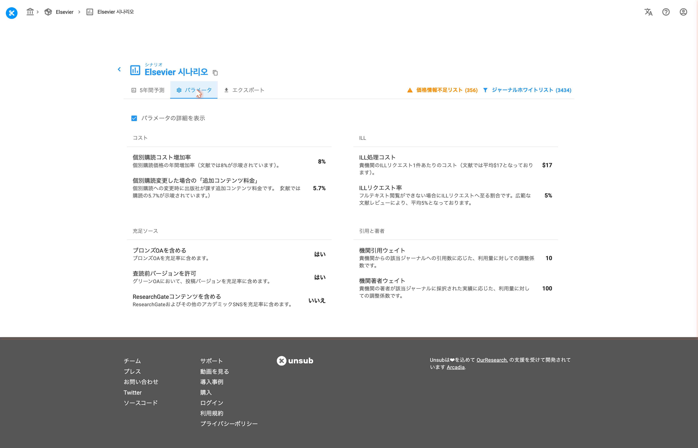
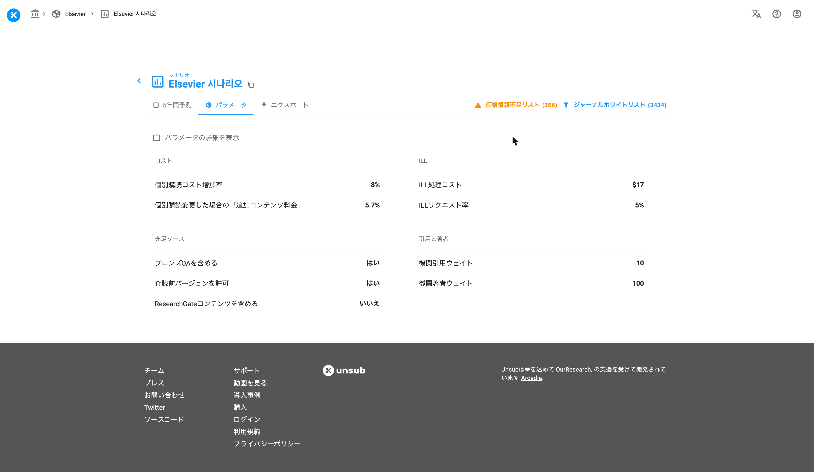
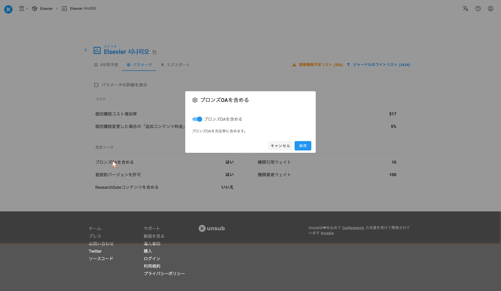

# パラメーター設定

> **※ 注意：** このページのスクリーンショットは英語版です。実際の画面は日本語で表示されます。

> **⚠️ 注意：**
> シナリオの作成がまだお済でない場合は、[こちら](/unsub_guide_jpn/chtoriaru/shinariono.md)から作成をお願いいたします。

Parameterのタブをクリックすると、9つのパラメータとその詳細についてのページが表示されます。

<figure><figcaption>
パラメータタブ（詳細表示あり）
</figcaption></figure>

各パラメーターの説明（詳細）は、表示のオン・オフを切り替えられるようになっています。

<figure><figcaption>
パラメータタブ（詳細表示なし）
</figcaption></figure>

初期設定では、パラメータの詳細は表示されています。&#x20;

設定できるパラメータは9種類です。このチュートリアルではBronze OA パラメータに焦点を当てますが、その他のパラメータについては各詳細をご確認ください。

Bronze OAとは、出版社のウェブサイトにて論文がオープンライセンスなしで自由に利用できるようにされた場合を指します。この場合当該の論文はいつでも取り下げられる可能性があります。

初期設定では、Bronze OA（オープンアクセス）を予測に加味しています。

Parametersタブを見ると、Include Bronze OAはこのように表示されます。&#x20;

<figure><figcaption>
ブロンズOAを含める＝はい（true）の状態
</figcaption></figure>

パラメータ名、説明、または値（下図の場合true）の領域のどこかをクリックすると、次のようなポップアップが表示されます。

<figure><figcaption>
「はい（true）」に設定されたブロンズOAのポップアップ
</figcaption></figure>

ポップアップの青いスイッチと「Include Bronze OA」という文字がある部分をクリックするとスイッチが左に移動し、以下のような白色に変わります。

<figure><figcaption>
「いいえ（false）」に変更されたブロンズOAのポップアップ
</figcaption></figure>

最後に「Save」をクリックして完了です。これで当該のシナリオにはBronze OAが加味されなくなりました。

このパラメータの変更によりシナリオに変化があったかどうかを確認するために、Bronze OAパラメータ変更前と変更後のシナリオのスクリーンショットを比較してみましょう。全体的に変化していますが、シナリオの左側にあるコストバーとアクセスバーに注目します。&#x20;

**ブロンズOAを含める = はい（Include Bronze OA = true）**&#x20;

<figure><figcaption></figcaption></figure>

**ブロンズOAを含めない = いいえ（Include Bronze OA = false）**

<figure><figcaption></figcaption></figure>

上の2つの画像を比較すると、コストが変化していることがわかりま&#x3059;**。**&#x42;ronze OAを含めない場合ILLのコストが高くなり、論文のリクエストを満たすために資金が必要になってきます。アクセスの内訳も変化しています。全体でオープンアクセスが占める割合は、Bronze OAを含めると35%なのに対し、含めない場合は30%に低下しています。

各シナリオパラメータの説明については、[シナリオパラメータ](/unsub_guide_jpn/refarensu/shinario/shinarionoparamta.md)の記事をご覧ください。

---

**次のステップ：** パラメータを設定したら、次は[シナリオ同士の比較](tutorials/comparing-scenarios.md)を行います。
